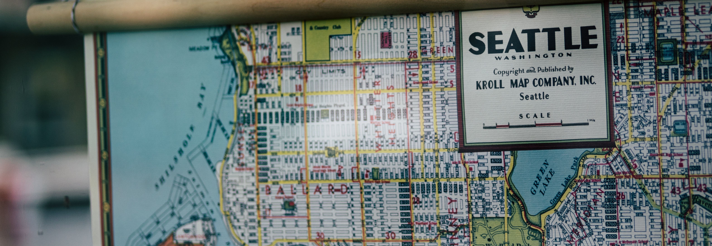

# Linli Shi
shilinli@uw.edu
>A Geographer who seeks to apply GIS techniques and data analysis to make raw data more accessible and solve real-world problems.
## Experience
### Geographical Mapping Support 
- [Svoboda Diaries Project](https://www.svobodadiariesproject.org/)
- Processing and geo-referencing historical maps from nineteenth-century Iraq
- Co-presented at the UW Undergraduate Research Symposium on the Geographical aspect of the research.
### Research Member: *Impacts of COVID-19 on Social Well-beings of Communities in King County* 
- Partnering with King County Equity Now to develop meaningful research questions and reflect on the current status of King County.
- Utilizing digital mapping tools along with research methodology to address the issue.
### Research Member: *Traffic Congestion in Seattle*
- Designed a prototype that helps people to make socially-conscious decisions when commuting.
### Student Mentor
- Worked with an underserved high school student on the college application process.
- Collaborated with colleagues from [Making Connections](https://www.washington.edu/womenscenter/making-connections/) to design effective plans for students.
## Education
- B.A. Geography: Data Science
- The University of Washington